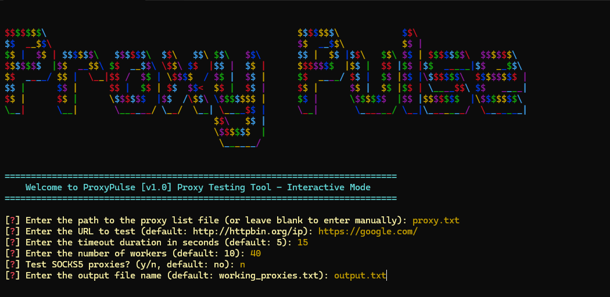
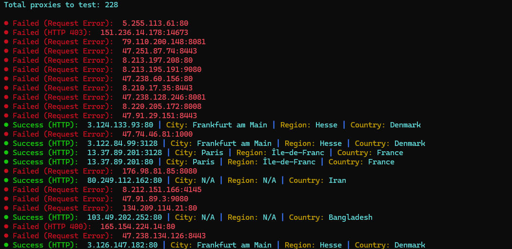
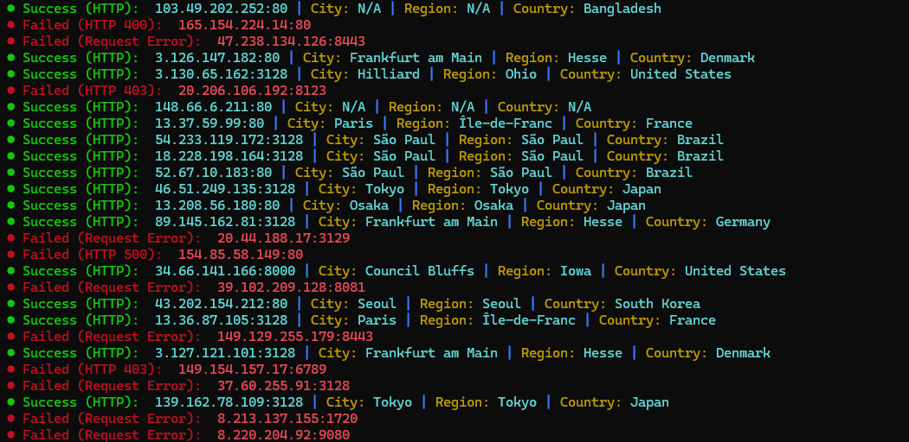

## 🛡️ ProxyPulse [v1.0]
[]() []() []() [](https://pypi.org/project/proxy-pulse/) [](https://github.com/yourusername/proxy_pulse/wiki) []()

ProxyPulse is a powerful proxy testing tool designed to validate and filter proxy lists efficiently. This tool supports interactive and command modes and provides detailed feedback on proxy performance, including location and connection status.

## 🕵️‍♂️ Features

- **Proxy Testing**: Test proxies for connectivity and response status.
- **Interactive and Command Modes**: Choose between an interactive mode for real-time interaction and a command mode for scriptable execution.
- **Proxy Location Information**: Retrieve and display detailed proxy location information.
- **Color-Coded Console Output**: Enhanced console output with color-coded success and error messages for better visibility.
- **Configurable Parameters**: Customize proxy testing parameters through a configuration file or command-line arguments.

## 📸 Screenshots




## ⚙️ Setup

To run your project on your local machine, follow these steps:

- ### 🛠️ Requirements

  - Python 3.x
  - `colorama` - Used for managing colored text and styles in the terminal; helps in managing system processes.
  - `requests` - Used for making HTTP requests and downloading files; allows interaction with APIs.
  - `termcolor` - Used for creating and managing colored and styled text in the terminal; enhances user interface appeal.


- ### 📥 Installiton
    Ensure you have Python 3.12 or later installed on your system. Clone the repository and install the required dependencies:

    - **Clone this repository**: Open a terminal and run:


        ```bash
        git clone https://github.com/Uveys-Yakut/Proxy-Pulse.git

    - **Navigate to the Project Directory**: Install the required Python   packages: 
       
       
       ```bash
       pip install -r requirements.txt

## 🧰 Usage
- ### 💻 Command Mode
    - To run the tool in command mode, use the following syntax:

        ```bash
        python main.py [OPTIONS]
        ```

    #### Options
    - `-h, --help`: Show this help message and exit.
    - `-m, --mode`: Specify the mode of operation (interactive or command). Only these values are allowed.
    - `-f, --file`: File containing a list of proxies to test.
    - `-u, --url`: The URL to test the proxy against.
    - `-t, --timeout`: Request timeout for each proxy (in seconds).
    - `-o, --output`: File to save the list of working proxies.
    - `-w, --workers`: Number of workers (default: 10).
- ### 👥 Interactive Mode
    - Run the tool in interactive mode for a user-friendly interface:
  
        
        ```bash
        python main.py -m interactive
    
    #### 💡 Example
    - Testing proxies using command mode: 
        
        
        ```bash
        python proxy_pulse.py -m command -f proxies.txt -u http://example.com -t 10 -w 5 -o working_proxies.txt

    -
        ```bash
        python proxy_pulse.py -m command -f proxies.txt -o output_proxy.txt

    -
        ```bash
        python proxy_pulse.py -m command -f proxies.txt -o output_proxy

    -
        ```bash
        python proxy_pulse.py -m command -f proxies.txt

## 📜 License

This project is licensed under the [MIT License](LICENSE)

## 👥 Contributors

**Uveys** - Project Manager and Developer

## 📬 Contact

For questions and feedback, you can reach me via email: uveysyakut859188@protonmail.com
